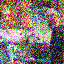

# Матрешечная Диффузионная Модель (MDM)

## О проекте

Матрешечная Диффузионная Модель (MDM) — это реализация диффузионной модели с вложенной архитектурой UNet для генерации изображений на основе текстовых описаний. Модель использует многоуровневую архитектуру, подобно вложенным матрешкам, как альтернативу каскадной генерации.

## Установка

### Зависимости

```bash
poetry install
```

### Датасеты

Проект поддерживает работу с несколькими датасетами:

- **Tiny ImageNet**: Упрощенная версия ImageNet для быстрого обучения и тестирования
- **Flickr30k**: Датасет изображений с текстовыми описаниями

```bash
# Для загрузки датасетов можно использовать скрипт
python load_datasets.py --dataset flickr30k
```

> Мы для упрощения использовали [Flickr30k](https://paperswithcode.com/dataset/flickr30k). [Вот как скачать](https://github.com/awsaf49/flickr-dataset)

## Обучение модели

### Запуск обучения

```bash
python main_train.py \
    --batch_size 32 \
    --epochs 5 \
    --lr 5e-5 \
    --num_levels 2 \
    --output_dir ./output
```

### Параметры обучения

| Параметр | Описание |
|----------|----------|
| `batch_size` | Размер батча |
| `epochs` | Количество эпох |
| `lr` | Скорость обучения |
| `log_freq` | Частота логирования |
| `save_freq` | Частота сохранения модели |
| `warmup_steps` | Количество шагов разогрева |
| `num_levels` | Количество уровней NestedUnet |
| `output_dir` | Директория для сохранения модели |
| `gradient_clip_norm` | Норма градиента |
| `image_size` | Размер изображения |
| `num_gradient_accumulations` | Количество накоплений градиента |
| `device` | Устройство (cpu или cuda) |
| `seed` | Сид для воспроизводимости |

## Генерация изображений

### Запуск инференса

```bash
python main_sample.py \
    --checkpoint ./output/checkpoint_latest.pt \
    --prompts "a cat sitting on a chair" "a dog running in a field" \
    --output_dir ./generated \
    --num_inference_steps 50
```

### Параметры инференса

| Параметр | Описание |
|----------|----------|
| `checkpoint` | Путь к чекпоинту |
| `prompts` | Промпты для изображений (для каждого изображения) |
| `output_dir` | Директория для сохранения изображений |
| `num_inference_steps` | Количество шагов инференса |
| `device` | Устройство (cpu или cuda) |
| `seed` | Сид для воспроизводимости |

> Завести сеть получилось только на 64 * 64 картинках.

## Примеры генерации

### Two scruffy-haired young men are chilling in the yard, glancing at their hands


### A little girl wearing a pink dress is climbing the stairs in the entranceway


### Two men, one in a gray shirt, one in a black shirt, standing near a stove


